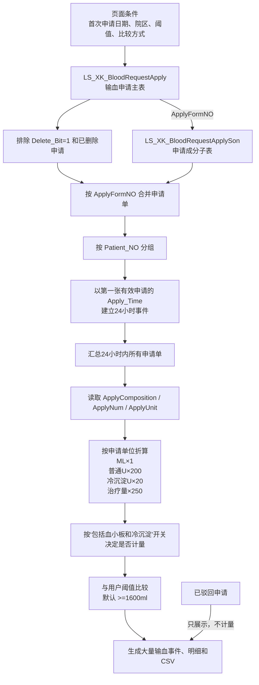
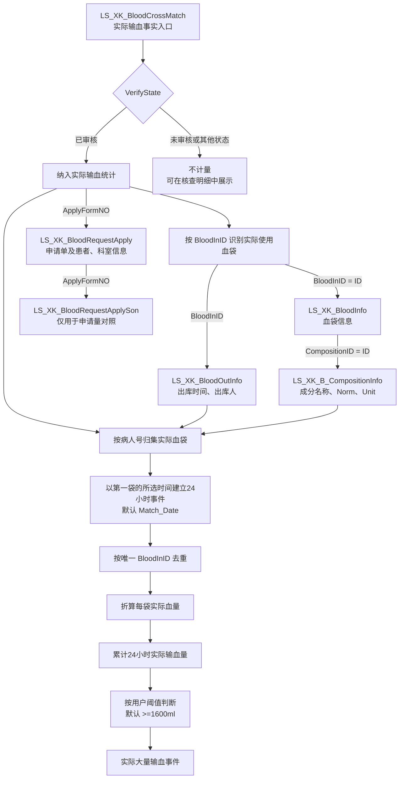

# 大量输血统计设计文档

本文档记录 `统计分析管理 -> 大量输血统计` 模块的实际输血量正式口径和保留的申请量对照口径。两套口径均已实现，页面现已正式默认“实际输血量”。

## 当前状态

- 当前入口：`统计分析管理 -> 大量输血统计(&5)`。
- 页面入口：`统计分析管理 -> 大量输血统计(&5)`，已替换原 `统计分析5(&5)` 占位页面。
- 核心代码：
  - `src/massive_transfusion_statistics_module.h/.cpp`
  - `src/search_core.h/.cpp` 中的 `query_massive_transfusion_statistics`、`build_massive_transfusion_statistics` 和 `build_actual_massive_transfusion_statistics`
  - `tests/massive_transfusion_statistics_test.cpp`
- 当前实现：页面可选择“申请量对照/实际输血量”。实际输血口径以已审核交叉配血记录为事实、按唯一血袋计量，支持四种事件时间、异常核查、事件/血袋两级 CSV；申请量逻辑原样保留用于对照。
- 构建状态：MinGW Windows 全量构建已通过；纯聚合测试样本已通过，实际输血量已切换为正式默认口径。
- 页面性质：只读统计页，不写入 LIS 业务表。
- 统计目标：按同一病人号识别 24 小时内累计申请量或实际输血量满足用户所选阈值条件的事件；默认条件为 `>= 1600 ml`。
- 患者识别：第一版只按去空格后的 `Patient_NO` 判断同一患者，不跨病人号合并，不使用姓名、身份证或住院次数辅助合并。
- 数据来源：
  - 申请主表 `LS_XK_BloodRequestApply`。
  - 申请成分子表 `LS_XK_BloodRequestApplySon`。
  - 实际输血事实表 `LS_XK_BloodCrossMatch`。
  - 血袋表 `LS_XK_BloodInfo`、出库表 `LS_XK_BloodOutInfo` 和血液成分字典 `LS_XK_B_CompositionInfo`。
- 可复用模块：
  - `src/backup_blood_statistics_module.h/.cpp` 的页面、后台查询、排序、导出和跨模块跳转结构。
  - `src/blood_module.h/.cpp` 的输血申请详情跳转接口。
  - `src/search_core.h/.cpp` 的 ODBC 只读查询基础设施。
- 单位值域和换算规则已确认：当前实际单位只有 `ML / U / 治疗量`；普通制品按 `1 ML = 1 ml`、`1 U = 200 ml`、`1 治疗量 = 250 ml` 折算，名称包含“冷沉淀”的制品按 `1 U = 20 ml` 折算。
- 24 小时事件划分、日期归属、申请状态范围、可调阈值、院区筛选和页面明细能力均已确认。

## 实际输血量口径（已实现并正式默认）

### 改造结论

原“大量输血统计”建立在输血申请单上，只能统计患者在24小时内申请了多少血液制品，不能证明血液已实际输给患者。本次正式口径已改为以交叉配血审核事实和实际血袋为依据。

2026-08-27 已补充确认：

- `LS_XK_BloodCrossMatch.VerifyState='已审核'` 表示该记录对应的血液已经实际输给患者。
- `LS_XK_BloodCrossMatch.VerifyState='未审核'` 表示没有实际输血，不贡献实际输血量。
- `LS_XK_BloodCrossMatch.ApplyFormNO` 对应输血申请单号；同一申请单可以有多行，因为可能实际使用多袋或多种成分血。
- `LS_XK_BloodCrossMatch.BloodInID` 标识实际使用的血袋，并关联 `LS_XK_BloodInfo.ID`。

因此，实际输血量口径把 `LS_XK_BloodCrossMatch` 作为核心事实表，把申请主表降为患者、科室及申请单核对来源。原申请量算法不删除，作为用户可选的“申请量对照”长期保留。

### 已确认的实际输血量业务口径

| 项目 | 已确认口径 |
| --- | --- |
| 时间字段 | 用户自行选择；默认 `LS_XK_BloodCrossMatch.Match_Date`（配血时间） |
| 其他时间选项 | `LS_XK_BloodOutInfo.BloodOut_Date`（出库时间）、`LS_XK_BloodRequestApply.Apply_Time`（申请时间）、`LS_XK_BloodRequestApply.Check_Date`（血库审核时间） |
| 页面日期归属 | 与所选时间字段一致，按事件第一袋血的所选时间归属 |
| 实际输血状态 | `VerifyState='已审核'` 参与统计；`未审核`不计量；其他或空状态进入异常核查 |
| 血袋唯一键 | `BloodInID` 唯一代表一袋血，一袋只能实际输给一个患者一次，不拆分、不分次输注 |
| 未审核占用 | 未审核记录中出现的 `BloodInID` 不视为已使用，之后仍可由另一输血单审核并实际使用 |
| 容量来源 | `BloodInfo.CompositionID -> CompositionInfo.Norm + CompositionInfo.Unit` |
| 交叉配血删除 | `CrossMatch.Delete_Bit=1` 不进入正式统计，但进入删除异常核查 |
| 退血等特殊状态 | 当前无其他字段，暂不处理退血、报废、撤销、冲销等情况 |
| 申请单异常 | 申请单已删除、已驳回、缺失或病人号不一致时，实际输血事实仍计入并标记异常 |
| 患者分组 | 使用 `LS_XK_BloodCrossMatch.Patient_NO`；申请表病人号仅核对 |
| 院区/科室/床号 | 取事件第一袋实际输血关联申请单的数据 |
| 多科室事件 | 明细保留每袋对应申请科室，事件标记“跨科室” |
| 血小板和冷沉淀 | 默认不计量，勾选后计量；冷沉淀 `1U=20ml` |
| 阈值 | 默认 `>=1600ml`，允许修改阈值并选择 `>=` 或 `>`，最多两位小数 |
| 申请量口径 | 保留作为对照；实际输血量完成现场对账后设为默认 |
| 容量异常 | 已知量满足阈值时仍命中并标记不完整；否则进入异常结果 |

### 当前申请量统计运行流程



当前代码的主要查询链路为：

```text
LS_XK_BloodRequestApply
    LEFT JOIN LS_XK_BloodRequestApplySon
        ON ApplyFormNO
```

当前流程没有读取 `LS_XK_BloodCrossMatch.VerifyState`，也没有通过 `BloodInID` 读取实际血袋。因此当前页面结果的准确业务名称应理解为“24小时大量用血申请统计”。

### 目标实际输血量统计链路



推荐主链路：

```text
LS_XK_BloodCrossMatch cm
    LEFT JOIN LS_XK_BloodRequestApply a
        ON a.ApplyFormNO = cm.ApplyFormNO
    LEFT JOIN LS_XK_BloodInfo bi
        ON bi.ID = cm.BloodInID
    LEFT JOIN LS_XK_B_CompositionInfo comp
        ON comp.ID = bi.CompositionID
    LEFT JOIN（按 BloodInID 一次性预聚合）LS_XK_BloodOutInfo bo
        ON bo.BloodInID = cm.BloodInID
```

`LS_XK_BloodOutInfo` 如果同一个 `BloodInID` 存在多行，不能直接连接后累计，否则会放大血袋数量。正式查询按 `BloodInID` 一次性预聚合出 `MIN(BloodOut_Date) + COUNT_BIG(*)`，再与实际输血事实连接；不再为每一条交叉配血记录执行相关聚合。申请表使用 `a.ApplyFormNO=cm.ApplyFormNO` 直接等值连接，现场只读核查已确认直接关联无缺失，从而避免连接列函数影响索引使用。

### 各表职责

| 表 | 实际输血量方案中的职责 |
| --- | --- |
| `LS_XK_BloodCrossMatch` | 核心事实表；通过 `VerifyState` 判断是否实际输血，通过 `BloodInID` 指向实际血袋 |
| `LS_XK_BloodInfo` | 提供血袋编号、产品码和 `CompositionID`；通过成分 ID 取得实际血袋规格 |
| `LS_XK_B_CompositionInfo` | 提供 `Blood_Composition / Norm / Unit`，作为已确认的实际血袋容量和单位来源 |
| `LS_XK_BloodOutInfo` | 提供 `BloodOut_Date / BloodOut_Man`；选择“出库时间”口径时使用 `BloodOut_Date` |
| `LS_XK_BloodRequestApply` | 提供申请单、患者、科室、床号、医生等业务信息，并与交叉配血患者信息交叉核对 |
| `LS_XK_BloodRequestApplySon` | 不再参与实际输血量合计，仅用于申请量、实际量和差值对照 |

实际输血事件的“制品构成”只由 `CompositionInfo.Blood_Composition` 及该血袋的 `Norm + Unit` 折算量汇总，不读取申请子表成分。页面和事件 CSV 在实际口径下显示“实际输血制品构成”，切换到申请量对照时显示“申请制品构成”，避免两种口径在展示层混淆。

### 实际输血事实筛选

查询需要同时读取正式记录和异常核查记录，不能在 SQL 层直接丢弃所有删除或未知状态行。正式计量记录至少满足：

```text
ISNULL(cm.Delete_Bit, 0) = 0
AND LTRIM(RTRIM(ISNULL(cm.VerifyState, ''))) = '已审核'
AND cm.BloodInID IS NOT NULL
```

处理建议：

- `VerifyState='已审核'`：参与实际输血事件和实际量合计。
- `VerifyState='未审核'`：不建立事件、不贡献实际量，可保留在“未审核核查”视图。
- `VerifyState` 为空或未知值：不静默计量，进入状态异常视图。
- `BloodInID` 为空：无法确定实际血袋，不计量并标记异常。
- `cm.Delete_Bit=1`：不进入正式统计；无论审核状态如何，保留在删除异常核查视图。

申请单状态不再决定实际输血事实。若交叉配血已审核，但申请单已删除、已驳回或缺失，推荐仍保留该实际输血记录，并标记“申请单异常”，不能让申请单状态覆盖已经发生的实际输血事实。

### 去重和冲突规则

实际统计的最小计量单元是一袋血，推荐主去重键为：

```text
BloodInID
```

同一个 `BloodInID` 只能贡献一次实际输血量。未审核记录不会消耗该血袋；只有最终出现的已审核有效记录才使该血袋参与实际量统计。聚合前仍进行防御性检查：

- 同一 `BloodInID` 是否存在多条已审核交叉配血记录。
- 同一 `BloodInID` 是否出现在多个 `ApplyFormNO`。
- 同一 `BloodInID` 是否关联多个 `Patient_NO`。
- 同一交叉配血记录是否因 `BloodOutInfo` 多行连接而被重复展开。
- `BloodInID` 是否找不到对应 `BloodInfo`。

按已确认业务规则，多条已审核记录不应出现相同 `BloodInID`。如果现场异常数据仍出现此情况，不重复计量，并列入“同一血袋多条已审核记录”异常核查。申请单或患者冲突同样不静默选择任意一行。

### 患者识别

实际输血量口径推荐以：

```text
LTRIM(RTRIM(LS_XK_BloodCrossMatch.Patient_NO))
```

作为患者分组键。`LS_XK_BloodRequestApply.Patient_NO` 用于核对，不用于覆盖交叉配血患者号：

```text
CrossMatch.Patient_NO == BloodRequestApply.Patient_NO
```

两者不一致时标记“交叉配血与申请单病人号不一致”。交叉配血病人号为空时不能仅凭姓名自动合并，应进入异常结果。

### 24小时时间字段与日期归属

页面提供“事件时间”下拉框，用户自行选择建立24小时事件和页面日期归属所使用的字段：

| 页面名称 | 数据库字段 | 默认 |
| --- | --- | --- |
| 配血时间 | `LS_XK_BloodCrossMatch.Match_Date` | 是 |
| 出库时间 | `LS_XK_BloodOutInfo.BloodOut_Date` | 否 |
| 申请时间 | `LS_XK_BloodRequestApply.Apply_Time` | 否 |
| 血库审核时间 | `LS_XK_BloodRequestApply.Check_Date` | 否 |

一次查询只能使用一种时间口径。事件 ID、排序、日期范围、24小时窗口、状态提示和 CSV 都必须记录本次选择，不能在同一次查询中混合多种时间来源。

推荐算法：

```text
按 Patient_NO 分组
    -> 实际输血血袋按 selected_time 升序
    -> 第一袋血的 selected_time 为 T0
    -> T0 <= selected_time < T0 + 24小时 的血袋进入同一事件
    -> 当前窗口结束后的下一袋血建立新事件
```

页面日期按事件第一袋血的 `selected_time` 归属；查询结束日期仍向后补齐 24 小时，以完整加载结束日期当天建立的事件。

### 实际血量来源与折算

实际容量和单位已确认使用：

```text
LS_XK_BloodCrossMatch.BloodInID
    -> LS_XK_BloodInfo.ID
    -> LS_XK_BloodInfo.CompositionID
    -> LS_XK_B_CompositionInfo.ID
    -> Norm + Unit
```

`Norm` 作为每袋数量，`Unit` 作为原单位，`Blood_Composition` 用于识别血小板、冷沉淀及制品构成。缺少成分、`Norm`、`Unit` 或无法折算时，不按 `0` 静默处理，事件标记为“实际量不完整”。

折算规则暂沿用现有版本：

| 实际血袋成分与单位 | 折算 |
| --- | ---: |
| `ML` | 数量 `× 1 ml` |
| 名称包含“冷沉淀”的 `U` | 数量 `× 20 ml` |
| 其他制品的 `U` | 数量 `× 200 ml` |
| `治疗量` | 数量 `× 250 ml` |

“血小板和冷沉淀”开关继续保留，但名称来源改为实际血袋关联的 `LS_XK_B_CompositionInfo.Blood_Composition`。未勾选时相关血袋保留明细但不贡献事件实际总量。

### 页面与导出实现

页面已增加“统计口径”：

```text
申请量对照
实际输血量
```

页面已正式默认“实际输血量”，默认事件时间为“配血时间”；用户仍可主动切换“申请量对照”。当前事件列表已展示：

- 第一袋实际输血时间、窗口结束时间和最后实际输血时间。
- 实际血袋数、实际输血量。
- 关联申请单数。
- 计量血袋数和核查记录数。
- 数据完整性及冲突状态。

实际血袋明细每袋一行，当前已展示并导出：

- 事件 ID、病人号、姓名、院区、科室和床号。
- 申请单号、交叉配血记录 ID、`BloodInID`。
- `VerifyState`、实际时间、配血时间、出库时间。
- 血袋编号、产品码和血液成分。
- 原始容量、单位、折算因子、实际折算量、是否计量。
- 原申请科室、床号、医生和异常说明。

申请量、实际量与差值的同事件并列展示，以及血型、Rh、血液来源字段，保留为现场对账后的增强项，不影响本次实际量统计。

事件 CSV 和实际血袋 CSV 必须记录：

- 统计口径。
- 所选事件时间字段及页面名称。
- 阈值与比较方式。
- 是否包括血小板和冷沉淀。
- 容量来源和折算规则版本。
- 去重键及数据完整性状态。

### 实施与验收步骤

1. 现场核查交叉配血、血袋、出库和成分表字段及值域，重点核对四个时间字段、`Norm` 和 `Unit` 的空值情况。
2. 已完成：新增独立的实际输血原始行结构、只读查询和纯聚合函数，未改写现有申请量聚合。
3. 已完成：按 `BloodInID` 去重，并覆盖已审核状态、重复血袋、申请单异常、时间缺失和容量折算测试。
4. 已确认：实际输血量正式设为默认统计口径，配血时间为默认事件时间。
5. 持续抽查：四种事件时间、跨科室事件、删除记录核查和申请单异常场景。
6. 申请量长期保留为对照，不再作为页面默认口径。

### 已确认的开发细节

2026-08-27 已确认以下实现规则，实际输血量方案不再有业务口径阻塞项：

1. 用户选择的时间字段为空时不回退其他时间，记录进入“时间缺失异常”，不参与24小时事件，避免同一次查询混用时间口径。
2. 删除、未审核、未知状态等异常核查视图严格使用本次所选时间字段和页面日期范围，与正式统计保持一致。
3. 如果同一个 `BloodInID` 意外关联多条 `LS_XK_BloodOutInfo`，选择“出库时间”时取最早的 `BloodOut_Date`，同时标记“多出库记录”；连接和聚合不得因此重复累计血袋。

实现说明：所选时间为空的记录没有可直接比较的日期。只读 SQL 使用四个候选时间的 `COALESCE` 仅作为异常记录的查询范围护栏；C++ 聚合仍严格判定所选时间为空、绝不把辅助时间回退为事件时间。四个候选时间全部为空的历史记录无法归属任何页面日期，因此不会被日期查询读取。

## 已确认的当前申请量业务口径

截至 2026-08-27，以下口径已确认并已实现：

| 项目 | 已确认口径 |
| --- | --- |
| 患者识别 | 第一版只按同一个病人号 `Patient_NO` 判断 |
| 统计时间 | 从事件第一张输血申请单的 `Apply_Time` 起算 24 小时 |
| 统计对象 | 24 小时内所有申请单申请的全部血液制品 |
| 事件划分 | 同一病人超过当前 24 小时事件后再次申请，建立新的独立事件；申请单不跨事件重复统计 |
| 日期归属 | 按事件第一张有效申请单时间归属 |
| 开始边界 | 页面开始日期内该病人的第一张有效申请作为新事件起点，不读取开始日期之前的申请参与分段 |
| 未审核申请 | 纳入事件和申请量统计 |
| 已驳回申请 | 不作为事件起点、不计入申请量，但保留展示 |
| 已删除申请 | 完全排除，不统计、不展示 |
| 子表缺失 | 不使用主表成分、数量和单位回退，标记数据异常 |
| 阈值 | 用户可输入大于 `0`、最多两位小数的毫升数；默认 `1600 ml` |
| 比较方式 | 用户可选“大于等于”或“大于”；默认“大于等于” |
| 实际单位值域 | `ML / U / 治疗量` |
| `ML` 换算 | `ApplyNum × 1 ml` |
| `U` 换算 | `ApplyNum × 200 ml` |
| `治疗量` 换算 | `ApplyNum × 250 ml` |
| 院区筛选 | 提供 `全部 / 老院 / 新院`，按申请科室名称派生 |
| 核对能力 | 查看并导出事件内每张申请单、每项制品及其折算明细 |

换算公式：

```text
成分折算量 =
    ApplyUnit = 'ML'     时 ApplyNum × 1
    ApplyUnit = 'U'      时 ApplyNum × 200
    ApplyUnit = '治疗量' 时 ApplyNum × 250
```

例如默认条件为 `>=1600ml` 时，`4 U + 2 治疗量 + 300 ML = 4×200 + 2×250 + 300 = 1600 ml`，应进入大量输血统计；切换为 `>1600ml` 后则不命中。

## 当前申请量功能目标

模块用于发现短时间内申请大量血液制品的患者，支持以下工作：

- 在指定日期范围内查找大量输血申请事件。
- 从一次事件的第一张输血申请单申请时间起算 24 小时。
- 汇总该 24 小时内同一病人号的所有有效申请单及其全部申请成分。
- 将不同制品的申请数量按经确认的规则折算为 `ml`。
- 正式命中列表展示累计折算量满足本次查询阈值和比较方式的事件。
- 展示事件涉及的患者、申请单、制品构成、起止时间和折算明细。
- 对无法折算、病人号为空、申请单号为空或申请成分缺失等数据单列异常，不静默忽略。
- 支持将当前明细导出为 CSV，并可跳转到输血结果查询核查原始申请单。

本节以下内容专门描述保留的“申请量对照”分支；页面正式默认口径已经是本文前部定义的“实际输血量”。

## 当前申请量实现的数据依据

### LS_XK_BloodRequestApply

申请主表包含本模块需要的主要患者和申请信息：

| 字段 | 用途 |
| --- | --- |
| `ID` | 主表物理行标识 |
| `ApplyFormNO` | 输血申请单号 |
| `Patient_NO` | 第一版患者分组键 |
| `Patient_NOType` | 患者类型，仅展示或筛选，不参与患者合并 |
| `Patient_Name` | 患者姓名 |
| `Patient_Sex` | 性别 |
| `Patient_Age`、`Patient_AgeUnit` | 年龄 |
| `Apply_Time` | 申请时间，也是 24 小时窗口的时间字段 |
| `ApplyForm_Statue` | 申请状态 |
| `Apply_Dept` | 申请科室和院区派生依据 |
| `Apply_DeptID` | 申请科室 ID，后续可用于精确院区映射 |
| `Apply_BedNo` | 床号 |
| `Apply_Doctor` | 申请医生 |
| `Delete_Bit` | 删除标志 |
| `ApplyComposition`、`ApplyNum`、`ApplyUnit` | 主表冗余申请成分字段；第一版明确不作为子表缺失时的回退来源 |

### LS_XK_BloodRequestApplySon

申请成分子表是申请量统计的优先事实来源：

| 字段 | 用途 |
| --- | --- |
| `ID` | 子表物理行标识，用于防止重复累计 |
| `ApplyFormNO` | 关联申请主表 |
| `ApplyComposition` | 申请血液制品名称 |
| `ApplyNum` | 申请数量 |
| `ApplyUnit` | 申请数量单位 |
| `VerifyNum`、`VerifyComposition` | 审核量和审核成分，本模块第一版不使用 |
| `CrossNum` | 配血量，本模块不使用 |
| `CompositionBig_ID` | 成分大类 ID，可用于辅助匹配折算规则 |
| `SonGuid` | 子项唯一识别字段，可作为数据核查辅助键 |

### LS_XK_B_CompositionInfo

血液成分字典包含：

| 字段 | 用途 |
| --- | --- |
| `ID` | 血液成分 ID |
| `Blood_Composition` | 血液成分名称 |
| `Unit` | 字典单位 |
| `Norm` | 血袋规格值，本模块第一版不用于申请量换算 |
| `CompositionTypeID` | 成分类型 ID |
| `Del_Flat` | 删除标志 |

现有输血历史页面将 `Norm + Unit` 作为血袋规格展示。本模块已经取得明确的申请单位换算规则，因此第一版不读取 `Norm`，也不依赖 `LS_XK_B_CompositionInfo` 完成换算。

## 当前申请量统计口径

### 患者键

第一版患者键：

```text
LTRIM(RTRIM(Patient_NO))
```

规则：

1. 同一个去空格后的病人号视为同一患者。
2. 暂不把 `Patient_NOType`、姓名、身份证或住院次数拼入患者键。
3. 空病人号不进入正式大量输血事件统计，计入“空病人号异常”。
4. 同一病人号被不同真实患者复用的风险由业务方接受；后续如需提高可信度，应单独升级患者身份匹配口径。

### 申请单键

申请单键：

```text
LTRIM(RTRIM(ApplyFormNO))
```

规则：

1. 同一申请单号只计一次主申请。
2. 同一申请单下的不同子表 `ID` 各计一条申请成分。
3. 空申请单号不进入正式统计，计入“空申请单号异常”。
4. 如果主表存在重复申请单号，患者、申请时间和展示字段采用最早有效主记录，并将重复情况标记为数据异常。

### 24 小时窗口

一次统计结果定义为一个不重叠的“24 小时申请事件”：

1. 按患者键分组。
2. 将患者的有效申请单按 `Apply_Time` 升序排列；有效申请包含未审核、已审核和已完结，不包含已驳回和已删除。时间相同时按申请单号和主表 `ID` 保证顺序稳定。
3. 第一张尚未归入事件的申请单时间作为事件起点 `T0`。
4. 当前事件纳入：

```text
T0 <= Apply_Time < DATEADD(hour, 24, T0)
```

5. `Apply_Time = T0 + 24小时` 的申请不属于当前事件，可作为下一事件起点。
6. 当前事件处理完毕后，从第一张未归入事件的申请单开始下一事件。
7. 每张有效申请单最多归入一个事件，不采用逐申请单滚动窗口，避免重复结果。
8. 已驳回申请不建立事件、不贡献申请量；若其申请时间落入某个有效事件窗口，则作为“已驳回、不计量”记录展示在该事件的申请单明细中。
9. 未落入任何有效事件窗口的已驳回申请进入独立的“已驳回申请”核查结果，不进入大量输血事件汇总。

示例：

| 申请时间 | 申请折算量 | 归属 |
| --- | ---: | --- |
| 08-01 08:00 | 1000 ml | 事件 A，起点 |
| 08-02 07:59 | 700 ml | 事件 A |
| 08-02 08:00 | 900 ml | 事件 B，起点 |

事件 A 合计 `1700 ml`，满足大量输血条件；事件 B 是否满足条件取决于随后 24 小时内的其他申请。

该不重叠事件方案已经确认。同一病人在当前事件结束后再次出现有效申请时，以该申请建立下一独立事件。

### 阈值

默认统计条件：

```text
折算总量 >= 1600 ml
```

- 阈值输入必须大于 `0`，允许最多两位小数，单位固定为 `ml`。
- 比较方式提供“大于等于”和“大于”，默认选择“大于等于”。
- 默认条件下等于 `1600 ml` 命中；选择“大于”时等于阈值不命中。
- 查询状态和两级 CSV 必须显示本次查询使用的完整条件，防止不同口径结果混用。

### 日期归属

页面日期筛选按“事件首次有效申请时间 `T0`”归属：

```text
开始日期 00:00:00 <= T0 < 结束日期次日 00:00:00
```

事件起点在选择范围内时，事件后续 24 小时即使跨越结束日期，也应完整加载并统计。例如结束日期为 8 月 31 日，事件起点为 8 月 31 日 20:00，则需要读取到 9 月 1 日 20:00 之前的申请。

为保证日期边界正确，查询不能只读取页面显示日期内的数据。建议：

- 数据加载起点为页面开始日期 `00:00:00`，不向前回溯。
- 数据加载终点为页面结束日期次日 `00:00:00 + 24小时`，用于补齐最后一天事件的完整窗口。
- 只有首次有效申请时间 `T0` 落在页面日期范围内的事件进入结果；结束日期之后读取的申请只能补充已有事件，不能建立新的结果事件。
- 已驳回申请落入已有事件窗口时随事件展示；未落入事件时，只有其自身申请时间位于页面日期范围内才进入独立已驳回核查视图。
- 不读取开始日期之前的申请参与事件分段。
- 对每个病人，将页面开始日期内的第一张有效申请直接作为新事件起点。
- 已驳回申请不能作为该起点；已删除申请不读取。
- 页面应说明日期范围按“事件首次有效申请时间”筛选，避免用户误解为所有申请单时间都必须落在范围内。

### 申请状态和删除范围

已确认状态口径：

- `Delete_Bit=1` 或状态为 `已删除`：完全排除，不建立事件、不计算、不展示。
- `未审核 / 已审核 / 已完结`：作为有效申请，参与事件建立和申请量累计。
- `已驳回`：查询并展示，但不建立事件、不贡献申请量。
- 其他未知状态：按异常状态展示，默认不贡献申请量，待核查后补充明确规则。

第一版不提供改变统计状态口径的筛选项，保证所有用户使用相同统计口径。事件内申请单明细和 CSV 必须包含原始状态，并为已驳回申请显示“不计量”。

## 当前申请量单位折算设计

### 原则

1. 不直接累加不同单位的 `ApplyNum`，先统一折算为 `ml`。
2. 当前换算通常取决于 `ApplyUnit`；名称包含“冷沉淀”且单位为 `U` 时使用专用因子。
3. 所有参与正式合计的成分行必须命中已确认的单位折算规则。
4. 当前实际单位只有 `ML / U / 治疗量`；出现其他单位、空单位或无效数量时视为数据异常，不得静默按 `0 ml` 处理。
5. 事件中存在无法折算成分时，默认不直接判定该事件“未超过阈值”，而应标记为“总量不完整”。
6. 折算规则变化后，相同历史数据可能得到不同结果，因此导出中应带折算规则版本或查询时间。

### 折算键

当前折算规则按“申请成分名称 + 规范化申请单位”匹配：

```text
规范化申请单位
```

规范化处理包括：

- 去除首尾空格后，将英文单位转成大写。
- `ML / ml / mL` 规范化为 `ML`，但现场当前实际值为 `ML`。
- `U` 保持为 `U`。
- `治疗量` 保持原值。
- 名称包含“冷沉淀”的制品在单位为 `U` 时使用专用因子 `20`；其他 `U` 使用因子 `200`。
- 名称包含“血小板”或“冷沉淀”的制品受页面“包括血小板和冷沉淀”开关控制。

推荐规则模型：

| 字段 | 含义 |
| --- | --- |
| 规范单位 | `ML / U / 治疗量` |
| 原始单位/别名 | LIS 中实际出现的单位文本 |
| 每单位毫升数 | `ApplyNum × factor_ml` |
| 是否启用 | 控制规则是否生效 |
| 备注 | 规则来源和确认人 |
| 规则版本 | 用于结果追溯 |

### 已确认折算表

当前共享折算规则版本 `v3` 内置以下已经确认的换算：

| 申请成分识别 | 申请单位 | 折算 |
| --- | --- | --- |
| 任意制品 | `ML` | `ApplyNum × 1` |
| 名称包含“冷沉淀” | `U` | `ApplyNum × 20` |
| 其他制品 | `U` | `ApplyNum × 200` |
| 任意制品 | `治疗量` | `ApplyNum × 250` |

页面默认不勾选“包括血小板和冷沉淀”。不勾选时，名称包含“血小板”或“冷沉淀”的成分不计入事件总量和计量制品项，但仍保留在成分明细与 CSV 中，并显示原始数量、单位、换算因子、折算量及“未勾选，不计量”状态；这些排除项本身不造成事件“总量不完整”。勾选后两类制品正常参与统计。

### 配置存放方案

推荐优先级：

1. 将已确认规则定义在 C++ 聚合逻辑中，当前共享规则版本记为 `v3`。
2. CSV 记录规则版本，保证历史结果可追溯；页面状态行不重复展示。
3. 若后续新增单位或更多按制品区分的规则，再迁移到本机 SQLite 配置，不写 LIS。
4. 当前仅允许用户控制是否纳入血小板和冷沉淀，不允许在统计页修改换算因子。

当前三种实际单位已经全部具有换算规则，可以直接实现正式统计。出现三种单位之外的值时进入异常列表，并提示值域发生变化，需要补充规则后再纳入正式结果。

### 折算异常处理

| 异常 | 处理 |
| --- | --- |
| `ApplyNum` 为空 | 不计入已知总量，标记“申请量为空” |
| `ApplyNum <= 0` | 不计入已知总量，标记“申请量无效” |
| `ApplyUnit` 为空 | 标记“申请单位为空” |
| 单位不是 `ML / U / 治疗量` | 标记“未识别申请单位” |
| 同一规范单位命中多条有效规则 | 阻止正式计算，标记“折算规则冲突” |
| 主表有申请量但子表为空 | 不使用主表回退，标记“申请成分子表缺失” |

事件存在异常成分时建议显示：

```text
已知折算量 1500 ml + 1 项无法折算
```

不能显示为“总量 1500 ml”，以免用户误认为事件确定未超过阈值。页面应支持“只看折算异常”。

## 现场数据核查

单位值域已经确认为 `ML / U / 治疗量`。正式开发和上线验收时仍建议执行以下只读 SQL，用于验证当前数据没有新增单位，并核查历史脏数据。

### 申请成分与单位分布

```sql
SELECT
    LTRIM(RTRIM(ISNULL(s.ApplyComposition,''))) AS ApplyComposition,
    LTRIM(RTRIM(ISNULL(s.ApplyUnit,''))) AS ApplyUnit,
    COUNT(*) AS RowCount,
    MIN(s.ApplyNum) AS MinApplyNum,
    MAX(s.ApplyNum) AS MaxApplyNum,
    SUM(CASE WHEN s.ApplyNum IS NULL THEN 1 ELSE 0 END) AS NullNumCount
FROM LS_XK_BloodRequestApplySon s WITH (NOLOCK)
GROUP BY
    LTRIM(RTRIM(ISNULL(s.ApplyComposition,''))),
    LTRIM(RTRIM(ISNULL(s.ApplyUnit,'')))
ORDER BY RowCount DESC, ApplyComposition, ApplyUnit;
```

### 成分字典规格

```sql
SELECT
    ID,
    LTRIM(RTRIM(Blood_Composition)) AS BloodComposition,
    LTRIM(RTRIM(Unit)) AS Unit,
    Norm,
    CompositionTypeID,
    Del_Flat
FROM LS_XK_B_CompositionInfo WITH (NOLOCK)
ORDER BY Del_Flat, Blood_Composition, Unit, Norm;
```

### 主表与子表覆盖率

```sql
SELECT
    COUNT(*) AS ApplyFormCount,
    SUM(CASE WHEN son.ApplyFormNO IS NULL THEN 1 ELSE 0 END) AS MissingSonCount
FROM LS_XK_BloodRequestApply a WITH (NOLOCK)
LEFT JOIN (
    SELECT DISTINCT LTRIM(RTRIM(ApplyFormNO)) AS ApplyFormNO
    FROM LS_XK_BloodRequestApplySon WITH (NOLOCK)
    WHERE NULLIF(LTRIM(RTRIM(ApplyFormNO)),'') IS NOT NULL
) son ON son.ApplyFormNO = LTRIM(RTRIM(a.ApplyFormNO))
WHERE ISNULL(a.Delete_Bit,0)=0
  AND a.Apply_Time>=@start_date
  AND a.Apply_Time<DATEADD(day,1,@end_date);
```

核查输出需要验证：

- 单位值域是否仍然只有 `ML / U / 治疗量`。
- 三种单位的数量是否存在空值、零值或负数。
- 主表成分字段是否只是子表冗余，是否存在子表缺失但主表有效的历史数据。
- 负数、零值、空数量是否有特殊业务含义。

## 当前申请量查询设计

### 查询对象

主查询返回申请成分行级数据，不在 SQL 中直接生成大量输血事件。建议字段：

```text
MainID
ApplyFormNO
PatientNO
PatientNOType
PatientName
PatientSex
PatientAge
ApplyTime
ApplyStatus
ApplyDept
ApplyDeptID
BedNo
ApplyDoctor
DeleteBit
SonID
SonGuid
ApplyComposition
ApplyNum
ApplyUnit
CompositionBigID
```

### SQL 形态

```sql
SELECT
    a.ID,
    LTRIM(RTRIM(ISNULL(a.ApplyFormNO,''))),
    LTRIM(RTRIM(ISNULL(a.Patient_NO,''))),
    LTRIM(RTRIM(ISNULL(a.Patient_NOType,''))),
    LTRIM(RTRIM(ISNULL(a.Patient_Name,''))),
    LTRIM(RTRIM(ISNULL(a.Patient_Sex,''))),
    LTRIM(RTRIM(ISNULL(CONVERT(varchar(20),a.Patient_Age),''))),
    LTRIM(RTRIM(ISNULL(a.Patient_AgeUnit,''))),
    CONVERT(varchar(19),a.Apply_Time,120),
    LTRIM(RTRIM(ISNULL(a.ApplyForm_Statue,''))),
    LTRIM(RTRIM(ISNULL(a.Apply_Dept,''))),
    a.Apply_DeptID,
    LTRIM(RTRIM(ISNULL(a.Apply_BedNo,''))),
    LTRIM(RTRIM(ISNULL(a.Apply_Doctor,''))),
    CASE WHEN ISNULL(a.Delete_Bit,0)=1 THEN 1 ELSE 0 END,
    s.ID,
    LTRIM(RTRIM(ISNULL(s.SonGuid,''))),
    LTRIM(RTRIM(ISNULL(s.ApplyComposition,''))),
    s.ApplyNum,
    LTRIM(RTRIM(ISNULL(s.ApplyUnit,''))),
    s.CompositionBig_ID
FROM LS_XK_BloodRequestApply a WITH (NOLOCK)
LEFT JOIN LS_XK_BloodRequestApplySon s WITH (NOLOCK)
       ON LTRIM(RTRIM(s.ApplyFormNO))=LTRIM(RTRIM(a.ApplyFormNO))
WHERE a.Apply_Time>=@load_start
  AND a.Apply_Time<@load_end
  AND ISNULL(a.Delete_Bit,0)=0
  AND LTRIM(RTRIM(ISNULL(a.ApplyForm_Statue,'')))<>'已删除'
ORDER BY
    a.Patient_NO,
    a.Apply_Time,
    a.ApplyFormNO,
    s.ID;
```

实际实现继续使用项目现有 ODBC 拼接方式，并对日期和筛选值做严格校验与 SQL 转义。查询保留已驳回申请供页面展示，C++ 聚合时将其标记为“不计量”；已删除申请在 SQL 层直接排除。

### 避免重复累计

主表左连接子表后，同一主申请会重复出现在多行。C++ 聚合时应采用两级结构：

```text
Patient_NO
  -> ApplyFormNO
       -> SonID/稳定子项键
```

- 申请单数按唯一 `ApplyFormNO` 计算。
- 申请量按唯一子项计算。
- 优先使用 `SonID` 去重。
- 如果 `SonID` 异常为空，使用 `SonGuid`；仍为空时使用完整行内容生成临时键并标记异常。
- 不把主表 `ApplyNum` 与子表 `ApplyNum` 同时累计。

### 主表成分回退

第一版已确认：

- 有任意有效子表明细：完全以子表为准。
- 没有子表明细时，即使主表成分、数量和单位完整，也不使用主表回退，不贡献申请量。
- 无子表明细的有效申请仍保留在事件申请单明细中，标记“申请成分子表缺失”。
- 主表和子表都无有效成分时同样标记“申请成分缺失”。

## 当前申请量 C++ 聚合算法

建议把时间窗口和折算计算实现为独立于 ODBC/UI 的纯函数，便于单元测试。

伪代码：

```text
读取行级数据
  -> 规范化病人号、申请单号、制品名和单位
  -> 按申请单聚合并对子项去重
  -> 按病人号分组
  -> 将非删除申请分为有效申请、已驳回申请和未知状态申请
  -> 每组有效申请按申请时间升序排列
  -> 从第一张未处理申请开始创建 24 小时事件
  -> 汇总窗口内有效申请和制品行
  -> 将窗口内已驳回申请附加为“不计量”展示明细
  -> 逐行应用折算规则
  -> 计算已知 ml、异常项数和数据完整性
  -> 完整事件且已知 ml >= 阈值：进入正式命中列表
  -> 不完整事件：进入折算异常列表，不自动判定未命中
```

建议的数据结构：

```cpp
struct MassiveTransfusionQuery;
struct MassiveTransfusionRawRow;
struct MassiveTransfusionComponent;
struct MassiveTransfusionApplication;
struct MassiveTransfusionEvent;
struct MassiveTransfusionSummary;
struct BloodVolumeConversionRule;
struct BloodVolumeConversionResult;
```

建议将纯计算函数与数据库入口分离：

```cpp
bool query_massive_transfusion_statistics(...);
std::vector<MassiveTransfusionEvent> build_massive_transfusion_events(...);
BloodVolumeConversionResult convert_blood_volume(...);
```

## 当前申请量页面设计

### 筛选区

当前采用两行筛选布局：

- `首次申请开始日期`。
- `首次申请结束日期`。
- `院区`：`全部 / 老院 / 新院`。
- `包括血小板和冷沉淀`：默认不勾选。
- `统计阈值`：比较方式下拉框加数值输入框，默认“大于等于 1600 ml”。
- `查询`。
- `导出事件`。
- `导出成分明细`。

筛选区下方状态行显示查询进度；完成后仅显示统计口径、事件时间、院区、事件/异常/核查数量、原始记录数和耗时。成分开关、统计条件直接以筛选控件为准，折算规则版本保留在 CSV 元数据中。

默认日期建议为当前自然月第一天至当天，页面打开后不自动查询，避免对 LIS 立即发起较大范围查询。

### 汇总区

建议指标：

| 指标 | 口径 |
| --- | --- |
| 大量输血事件数 | 完整折算且满足本次查询阈值条件的事件数 |
| 涉及患者数 | 命中事件中的唯一病人号数 |
| 涉及申请单数 | 命中事件包含的唯一申请单数 |
| 累计申请量 | 命中事件的已知折算量合计 |
| 折算异常事件数 | 至少存在一项无法折算的事件数 |
| 无法折算成分数 | 无法折算的唯一子项数 |
| 空病人号异常 | 有效申请中病人号为空的申请单数 |
| 空申请单号异常 | 有效申请中申请单号为空的物理行数 |
| 已驳回申请数 | 查询范围内展示但不计量的唯一已驳回申请单数 |

大量输血事件和折算异常事件应分开统计，不能把总量不完整的事件当作确定未命中。

### 明细区

建议每行代表一个 24 小时事件，而不是一张申请单或一条成分：

| 列名 | 来源/口径 |
| --- | --- |
| 院区 | 根据首张申请的申请科室派生 |
| 病人号 | 患者键 |
| 姓名 | 首张申请姓名，姓名变化时标记异常 |
| 患者类型 | 首张申请 `Patient_NOType` |
| 首次申请时间 | `T0` |
| 窗口结束时间 | `T0 + 24小时` |
| 最后申请时间 | 当前事件中最后一张申请时间 |
| 折算总量 | 完整时显示 `xxxx ml`；不完整时显示“已知 xxxx ml + N 项异常” |
| 申请单数 | 唯一申请单号数 |
| 制品明细 | 参与统计制品的数量、原单位和折算量摘要；已驳回制品明确标记“不计量” |
| 第一张申请单号 | 用于跳转 |
| 所有申请单号 | 分号拼接 |
| 申请科室 | 首张申请科室；多科室时提示 |
| 床号 | 首张申请床号 |
| 申请状态 | 事件内各状态去重拼接，已驳回标记“不计量” |
| 数据状态 | 完整、折算异常、子表缺失、重复申请单等 |

事件列表下方必须提供“事件内申请成分”子列表。用户选择事件后，展示每张申请单及每条申请成分的申请时间、原始数量、单位、换算因子、折算结果、申请状态和是否计量；已驳回申请及其成分显示但标记“不计量”。此外提供独立的“已驳回申请”核查视图，展示查询范围内未归入有效事件的已驳回申请。

### 院区口径

第一版按申请科室名称派生院区，沿用现有备血统计规则：

| 条件 | 院区 |
| --- | --- |
| 首张申请 `Apply_Dept` 包含“滨水” | 新院 |
| 其他情况，包括空值 | 老院 |

当前确认按科室名称判断，不使用 `Apply_DeptID`。院区筛选在 C++ 事件生成后完成，再计算汇总，避免主 SQL 增加模糊匹配条件。

如果同一事件跨院区或跨科室，事件院区仍按首张申请归属，并在数据状态中显示“跨院区/跨科室”。

### 行配色

建议：

| 状态 | 背景色 |
| --- | --- |
| 完整且达到阈值 | 浅红或浅橙，突出大量输血事件 |
| 存在折算异常 | 浅黄 |
| 子表缺失或重复数据 | 浅灰 |
| 已驳回、不计量 | 浅灰并显示“不计量”文字 |

颜色只用于辅助识别，数据状态列必须保留明确文字。

## 界面简化与视觉优化设计

### 用户目标

界面应优先回答四个问题：本次按什么口径查询、命中了多少事件、哪些患者需要关注、当前事件由哪些实际血袋或申请成分构成。数据库 ID、多表关联状态和其他核查字段不能消失，但不应占据默认视图的主要空间。

本轮界面优化只调整展示层，不改变查询 SQL、24 小时事件算法、统计阈值、折算规则、异常判定或 CSV 字段。

### 页面信息层级

```text
┌─ 查询条件 ───────────────────────────────────────────────┐
│ 事件日期 / 院区 / 统计口径 / 事件时间                    │
│ 阈值 / 制品开关                         查询 / 导出       │
└───────────────────────────────────────────────────────────┘
  查询口径、事件/异常/核查数、原始记录数和耗时

┌────────┬────────┬────────┬────────┬────────┬────────┐
│事件数  │患者数  │折算总量│血袋/项 │异常事件│核查记录│
└────────┴────────┴────────┴────────┴────────┴────────┘

事件主列表：默认只显示判定、患者、时间窗口、总量、血袋/项、
            制品构成、科室和数据状态。

[当前事件血袋/成分] [全部血袋/成分] [异常核查]
当前患者、事件窗口、折算量和计量项上下文
逐袋或逐申请成分明细
```

### 查询区

- 使用带标题的“查询条件”分组框，将条件区和结果区明确分开。
- 第一行放事件日期、院区、统计口径和事件时间；第二行放阈值、制品开关和操作按钮。两行内容从分组框左边缘统一内缩，起始标签左对齐并共享相同首列宽度，使首个输入控件也纵向对齐；同组控件使用紧凑间距，不同筛选组之间保留更明显的分隔空间。
- “查询”作为主操作按钮；导出按钮保持独立，避免改变现有导出行为。
- 统计口径选择“申请量对照”时，事件时间固定为申请时间并禁用事件时间下拉框。
- 分组框顶部预留独立标题安全区，两行控件、状态行和指标卡片均使用连续计算的 DPI 间距，不能以互相覆盖的固定坐标排布。MDI 子窗口不单独处理 `WM_GETMINMAXINFO`，保持与其他模块一致的最大化和标题栏行为。
- 查询期间禁用条件和主操作，保留上一轮成功结果；查询完成状态仅显示统计口径、事件时间、院区、事件数、异常数、核查数、原始记录数和耗时。阈值、制品开关及规则版本不在状态行重复展示，分别以当前筛选控件和导出元数据为准。

### 关键指标卡片

原十列表格式汇总改为六个横向指标卡片：

| 指标 | 展示规则 |
| --- | --- |
| 大量输血事件 | 命中当前阈值的事件数 |
| 涉及患者 | 命中事件的唯一患者数 |
| 实际输血总量/申请折算总量 | 随统计口径切换标题 |
| 实际血袋/计量制品项 | 随统计口径切换标题 |
| 异常事件 | 存在数据或折算异常的事件数 |
| 核查记录 | 独立核查记录数 |

关联申请单数、异常项数、空病人号和空申请单号仍保留在数据结构、状态与导出中，不占用默认摘要区。

### 事件主列表

默认展示以下高频列：结果、院区、病人号、姓名、事件起始时间、窗口结束时间、折算总量、计量项/血袋、制品构成、申请科室和数据状态。

患者类型、最后计量时间、关联申请单数、核查记录数、首袋申请单、全部申请单、床号和申请状态作为低频核查列，默认宽度设为零；字段仍保留在 ListView 数据和事件 CSV 中，不影响排序数据、导出或跨模块跳转。后续可增加“选择显示列”菜单供高级用户恢复显示。

### 明细页签与事件上下文

原明细范围下拉框改为三个页签：

- 实际输血口径：`当前事件血袋 / 全部血袋 / 异常核查`。
- 申请量对照：`当前事件成分 / 全部成分 / 异常核查`。

页签右侧固定显示当前患者、事件窗口、折算量和计量项数量。选择不同事件时立即更新上下文和当前事件明细；切换到异常核查时显示核查记录数量。

逐项明细默认展示事件、患者、申请单、事件时间、血袋号、是否计量、制品、规格、单位、折算量、科室和数据状态。交叉配血 ID、血袋 ID、产品码、各业务时间及其他技术字段默认隐藏，但继续完整导出到 CSV。

### 后续增强

- 增加“选择显示列”和恢复默认列宽。
- 将两个导出按钮合并为带菜单的“导出”，支持当前事件、全部事件和异常核查范围。
- 为命中、完整、核查、排除和异常状态增加更细粒度的图标或标签；颜色继续只作为文字状态的辅助。
- 记录用户的列显示偏好，但不得写入 LIS 业务数据库。

## 跨模块跳转

双击正式命中事件时：

1. 打开或激活“输血结果查询”。
2. 使用事件第一张申请单号和申请日期执行精确查询。
3. 选中对应申请单并刷新右侧详情。
4. 不自动切换输血结果查询的右侧页签。

可复用 `blood_module.h` 中的 `WM_BLOOD_OPEN_REQUEST` 和 `BloodRequestOpenTarget`。如果用户要核查事件内其他申请单，可在事件详情列表中双击对应申请单分别跳转。

## 当前申请量 CSV 导出

导出格式：UTF-8 BOM CSV。

默认文件名：

```text
开始日期-结束日期大量输血统计明细-{全部|老院|新院}.csv
```

导出当前页面筛选和排序后的内存结果，不重新查询数据库。

建议导出字段：

- 查询日期范围。
- 统计条件，包括比较方式、阈值数值和 `ml` 单位。
- 折算规则版本。
- “包括血小板和冷沉淀”查询开关状态。
- 院区。
- 病人号、姓名、患者类型。
- 首次申请时间、窗口结束时间、最后申请时间。
- 折算总量、数据是否完整、异常项数。
- 申请单数量、第一张申请单号、所有申请单号。
- 制品构成和逐项折算摘要。
- 科室、床号、状态和数据异常说明。

页面必须提供“导出成分明细”，每行代表一条申请成分，并包含所属事件、申请单状态、是否计量、原始数量、原始单位、换算因子和折算结果。事件内已驳回申请也随成分明细导出并标记“不计量”；未归入事件的已驳回申请可从独立核查视图导出。

## 性能与数据库影响

- 模块只执行 `SELECT`，不写 LIS 表。
- 查询按 `Apply_Time` 限定范围，避免无条件读取全部历史。
- 子表已有 `ApplyFormNO` 索引，可支持主子表关联。
- 当前表规模约数万级时，按月查询并在 C++ 内存聚合可接受；仍需现场测量查询耗时。
- 如果 `LS_XK_BloodRequestApply.Apply_Time` 无索引且历史数据增长明显，应由数据库管理员评估索引，客户端不自动修改 LIS 表结构。
- 后台线程执行查询，查询完成后一次性更新页面；查询期间保留上一轮成功结果。
- 填充大量 ListView 行时使用 `WM_SETREDRAW` 暂停重绘，完成后统一刷新。
- 日志可以记录查询范围、返回行数、聚合事件数和耗时，但不得记录患者姓名等非必要敏感信息。

## 当前申请量代码改动范围

已新增：

- `src/massive_transfusion_statistics_module.h`
- `src/massive_transfusion_statistics_module.cpp`
- `MASSIVE_TRANSFUSION_STATISTICS_DESIGN.md`（本文档）

已修改：

- `src/main_frame.cpp`
  - 引入新模块头文件。
  - 将 `Stat5` 占位工厂替换为 `create_massive_transfusion_statistics_module`。
  - 菜单文字改为 `大量输血统计(&5)`。
- `src/search_core.h`
  - 增加查询、原始行、申请单、事件、汇总和折算规则结构。
  - 声明查询和纯聚合函数。
- `src/search_core.cpp`
  - 增加只读 ODBC 查询。
  - 实现或调用独立的纯聚合逻辑。
- `CMakeLists.txt`
  - 将新模块源文件加入 `main_app`。
- `README.md`
  - 增加模块当前实现说明。
- `PROJECT_STRUCTURE.md`
  - 增加新模块文件与职责说明。
- `QUERY_DESIGN.md`
  - 补充数据查询和聚合口径。
- `CHANGELOG.md`
  - 实现完成后记录功能。

当前版本使用固定换算逻辑和一个查询开关，不需要扩展本机 SQLite 或设置页面。后续单位值域或制品规则发生变化时，再评估按现有 `quality_control_store` 模式增加本机规则配置。

## 当前申请量分阶段实施记录

### 阶段 0：现场值域核查（待现场完成）

- 导出制品名、单位、数量分布，验证实际单位仍只有 `ML / U / 治疗量`。
- 核查主表与子表覆盖率。
- 按已确认规则核对 `ML×1 / 普通U×200 / 冷沉淀U×20 / 治疗量×250` 的人工样本。
- 按已确认的事件、日期、状态和删除口径准备人工样本。
- 选择至少 10 个典型患者完成人工计算样本。

阶段 0 未完成前，不建议发布正式统计结果。

### 阶段 1：查询与纯计算核心（已完成）

- 定义数据结构。
- 实现行级只读查询。
- 实现申请单聚合、去重、24 小时事件划分和折算。
- 为时间边界、去重、阈值和异常规则增加测试。
- 使用人工样本进行离线核对。

### 阶段 2：页面和导出（已完成）

- 替换 `统计分析5` 占位入口。
- 实现筛选、汇总、事件明细和状态提示。
- 实现本地排序、CSV 导出和输血申请跳转。
- 查询失败时保留上一轮成功结果。

### 阶段 3：现场对账和优化（待现场完成）

- 与输血科人工统计逐事件核对。
- 核查跨日、跨月和临界时间。
- 核查未知单位和历史脏数据。
- 测量典型日、月范围的查询耗时。
- 根据对账结果调整折算别名和规则，不随意改变时间算法。

## 当前申请量测试与验收用例

### 时间窗口

| 场景 | 预期结果 |
| --- | --- |
| 首单 08:00，第二单次日 07:59 | 两单属于同一事件 |
| 首单 08:00，第二单次日 08:00 | 第二单属于下一事件 |
| 事件起点在结束日期 23:59 | 继续读取并统计后续 24 小时 |
| 同一时间存在多张申请单 | 全部进入同一事件，顺序稳定 |
| 同一患者相隔超过 24 小时再次申请 | 生成新事件 |

### 阈值

| 折算总量 | 预期结果 |
| ---: | --- |
| `1599.99 ml` | 不命中 |
| `1600.00 ml` | 命中 |
| `1600.01 ml` | 命中 |
| `1700 ml`，但另有一项无法折算 | 进入命中并标记数据不完整 |
| `1500 ml`，另有一项无法折算 | 不能判定未命中，进入异常列表 |

已知折算量已经达到或超过阈值、但仍存在异常项时，仍作为命中，因为未知项不可能降低已知总量；页面同时标记数据不完整。已知折算量未达到阈值且存在未知项时进入异常列表，不判定为未命中。

上表使用默认条件 `>=1600ml`。切换为 `>1600ml` 时，`1600.00 ml` 不命中，`1600.01 ml` 命中。

### 去重与数据异常

| 场景 | 预期结果 |
| --- | --- |
| 同一申请单有多个成分子项 | 申请单数加 1，所有唯一子项分别累计 |
| 主表因连接子项出现重复行 | 不重复计算申请单 |
| 同一 `SonID` 重复返回 | 子项只累计一次 |
| 主表和子表都有数量 | 只使用子表，不双重累计 |
| 子表为空、主表有完整数量 | 不使用主表回退，标记子表缺失且不贡献申请量 |
| 空病人号 | 不进入正式事件，异常数加 1 |
| 空申请单号 | 不进入正式事件，异常数加 1 |
| 空申请时间 | 无法建立窗口，进入异常列表 |
| 同一病人号姓名不一致 | 仍按病人号聚合，同时标记姓名不一致 |

### 状态和删除

| 场景 | 预期结果 |
| --- | --- |
| `Delete_Bit=1` | 不统计 |
| 状态为已删除 | 不统计 |
| 状态为已驳回，落入有效事件窗口 | 展示申请单和成分，但不建立事件、不计量 |
| 状态为已驳回，未落入有效事件窗口 | 在独立已驳回核查视图展示，不进入事件汇总 |
| 状态为未审核 | 统计 |
| 状态为已审核 | 统计 |
| 状态为已完结 | 统计 |

### 单位折算

| 场景 | 预期结果 |
| --- | --- |
| `800 ML + 900 ML` | `1700 ml`，命中 |
| `1100 ML + 2 U + 1 治疗量` | `1750 ml`，命中 |
| `2 U` | 折算为 `400 ml` |
| 名称包含“冷沉淀”的 `2 U` | 折算为 `40 ml` |
| `2 治疗量` | 折算为 `500 ml` |
| `800 ML + 2 U + 2 治疗量` | 折算为 `1700 ml`，命中 |
| 未勾选“包括血小板和冷沉淀” | 名称包含“血小板”或“冷沉淀”的行保留明细但不计量 |
| 勾选“包括血小板和冷沉淀” | 两类成分按规则折算并参与事件总量 |
| 单位为 `袋` 等非现有值域 | 标记无法折算，不按 0 处理 |
| 数量为 0、负数或空 | 标记无效申请量 |
| 单位为 `ML / ml / mL` | 规范化为 `ML` 后按 ml 处理 |
| 单位为 `毫升` | 不属于当前确认值域，标记异常并核查来源 |

### 页面和导出

| 场景 | 预期结果 |
| --- | --- |
| 点击表头 | 对当前内存结果排序，不重新查询 |
| 改变院区后查询 | 汇总和明细均只包含所选院区 |
| 导出 | 使用当前过滤和排序结果，不重新访问 LIS |
| 双击正式事件 | 跳转并定位第一张输血申请单 |
| 查询失败 | 显示错误并保留上一轮成功结果 |

## 已确认的当前申请量开发决策

以下事项均已确认，不再列为开发前阻塞项：

1. 使用不重叠 24 小时事件；同一病人在当前事件结束后再次有效申请时建立新事件。
2. 日期按事件第一张有效申请单时间归属。
3. 不读取页面开始日期之前的申请参与分段；页面范围内第一张有效申请作为新事件起点。
4. 未审核申请参与事件和申请量统计。
5. 已删除申请完全排除；已驳回申请展示但不建立事件、不贡献申请量。
6. 子表无申请成分时不使用主表回退，标记异常且不贡献申请量。
7. 阈值默认 `1600 ml`，允许输入大于 `0` 且最多两位小数的数值；比较方式默认“大于等于”，可切换为“大于”。
8. 提供院区筛选，按申请科室名称派生新老院区。
9. 必须查看和导出事件内每张申请单、每项制品及折算明细。

## 当前申请量第一版冻结口径

第一版冻结口径：

- 同一患者只按去空格后的 `Patient_NO` 判断。
- 按不重叠 24 小时事件统计。
- 页面日期按事件首次申请时间归属。
- 窗口左闭右开：`T0 <= Apply_Time < T0 + 24小时`。
- 统计条件默认 `>= 1600 ml`，允许用户调整阈值和选择 `>=` 或 `>`。
- 已删除完全排除；未审核、已审核、已完结参与统计；已驳回展示但不建立事件、不计量。
- 申请量优先且仅使用申请子表，不累计审核量、配血量或出库量。
- 子表没有申请成分时不使用主表字段回退，标记数据异常。
- 名称包含“血小板”或“冷沉淀”时由默认不勾选的“包括血小板和冷沉淀”开关控制是否计量；排除时保留明细，不影响数据完整性判断。
- 单位规范化后按固定规则折算：`ML×1 / 普通U×200 / 冷沉淀U×20 / 治疗量×250`，当前共享规则版本为 `v3`。
- 无法折算的数据明确进入异常列表。
- 已知折算量达到或超过阈值时列入命中，即使另有未知项，同时标记“总量不完整”。
- 已知折算量未达到阈值且存在未知项时，不判定未命中，进入异常列表。
- 默认查询当前自然月，打开页面后不自动查询。
- 提供全部、老院、新院筛选，按申请科室名称包含“滨水”派生新院，其他为老院。
- 模块只读 LIS，支持事件级和成分级 CSV、事件内申请成分查看、排序及申请单跳转。

## 当前申请量完成标准

满足以下条件后方可认为模块完成：

- 业务方已签字或明确确认折算规则和统计口径。
- 现场实际制品和单位值域均有对应规则或明确异常处理。
- 24 小时时间边界、阈值边界、重复数据和异常数据测试通过。
- 至少 10 个典型患者由程序结果与人工统计逐项对账一致。
- 跨日、跨月、结束日期后延 24 小时场景验证通过。
- 查询不写入 LIS 业务表。
- 查询失败不会清空上一轮成功结果。
- CSV 与页面当前筛选、排序和折算结果一致。
- 双击事件能够定位到正确的输血申请单。
- README、项目结构、查询设计和变更日志已同步更新。
